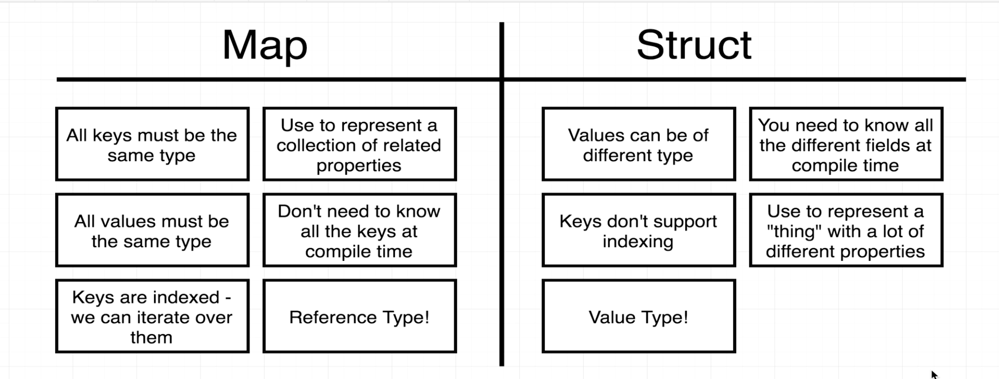

# Section 5 Maps
A collection of key, value pairs. It is similar python dict. 

Map must have the same type of all the keys. All the values must be the same type. A struct can have different types for values.

## Declare/Init a map

```go
    colors := map[string] string {
        "red": "#ff0000",
        "green": "#00ff00",
    }

    var colrs map[string] string

    clors := make(map[string] string)

    // set value
    clors["blue"] = "#0000ff"
    // delete a key-value pair
    delete(clors, "blue")
```

## Iterate a map
```go
    for color, hex := range clors {

    }
```

## Difference between map and struct
.
Map is a reference type, while struct is a value type. For a struct, all the keys are fixed in compile time. Map can have dynamic keys.
