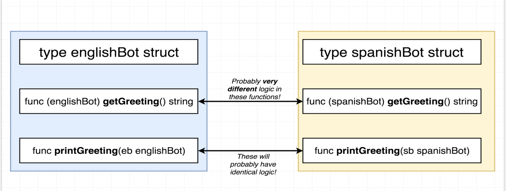
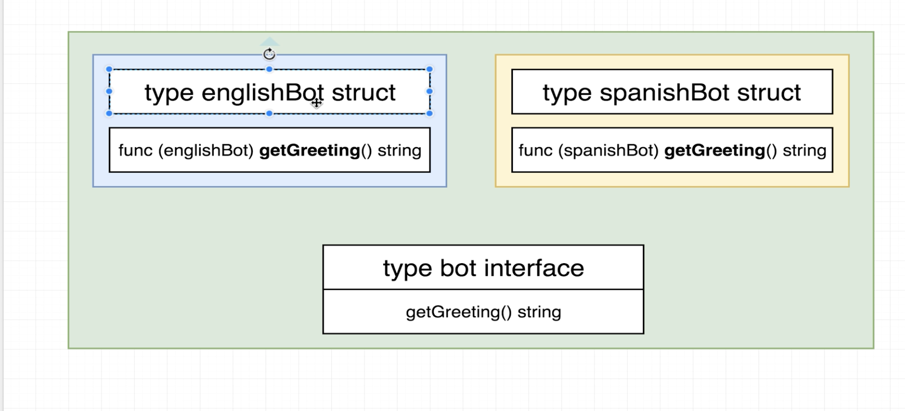

# Section 6 Interface
It is almost like template in C++. A template function in C++ is a generic logic that can work on different types. 

Different logic of different types shall be factorized into an interface:  Then the similar logic can be programmed to the interface.

Interfaces don't have receiver functions. An interface is a collection of function signatures, not a concrete struct implementation. Only concrete structs have receiver functions. Interface is not a concrete type in GoLang.

Interface is a new type. It summarizes the same function signature (getGreeting here) of different types (englishBot and spanishBot) with different logic: 

## Notes of interface
* Not a generic type like interface in Java
* Interface is implicit. No need to say `englishBot implements bot`. Not need to link bot and englishBot. Hard to keep track.
* A contract to help us to manage types.

## More interface syntax
Interfaces can be assembled together into another interface.
```go
type itf1 {
    goo() string
}
type itf2 {
    foo() string
}
type itf3 {
    itf1
    itf2
}
```


